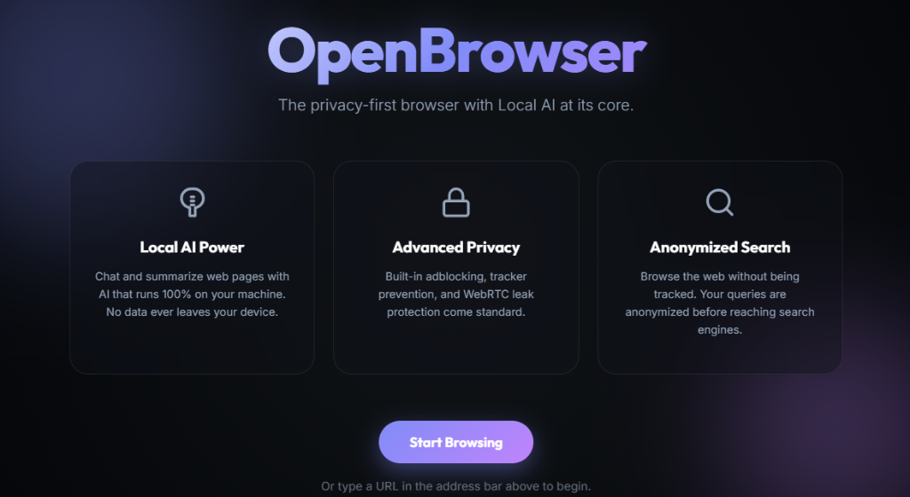

# 💎 OpenBrowser: The Ultra-Premium Privacy Browser

[](https://github.com/ChrisD1231/OpenBrowser/stargazers)
[](LICENSE)

**OpenBrowser** is a high-performance, privacy-first web browser built with **Electron**. It combines a sleek, "Crystal" glassmorphism aesthetic with cutting-edge privacy features, including a local AI engine and an integrated regional privacy tunnel (VPN).

---

## 🛡️ Core Pillars

### 1. Unified Privacy Tunnel (VPN)
Route your traffic through secure, high-anonymity regional nodes. 
- **Global Nodes**: US, UK, Germany, and Japan.
- **Identity Masking**: Automatically adjusts User-Agent and Language headers to match your selected region.
- **One-Tap Toggle**: Instant activation with a pulsing real-time status badge.

### 2. Local AI Engine 🧠
Powered by **Ollama**, OpenBrowser lets you chat with and summarize web pages without your data ever leaving your machine.
- **Privacy First**: 100% local processing.
- **Model Support**: Llama 3, Mistral, and Phi-3.
- **Context Aware**: Instantly summarize complex articles or research papers.

## ⚙️ Core Technical Features
- **Engine**: Electron + Chromium
- **Styling**: Vanilla CSS (Premium Design System)
- **Database**: SQLite (better-sqlite3) with SHA-256 Hashing
- **Network**: Integrated Proxy Routing + Adblocker Engine
- **AI**: Ollama (Local LLM Integration)

---

## 📸 Screenshots
*(Coming Soon: Add your real browser screenshots to `docs/images/` to see them here!)*

| Main Interface | Settings Panel | Landing Page |
| :---: | :---: | :---: |
|  |  |  |

---

## 🚀 Getting Started

### Prerequisites
- [Node.js](https://nodejs.org/) (v18+)
- [Ollama](https://ollama.com/) (For AI features)

### Installation
1. Clone the repository:
   ```bash
   git clone https://github.com/ChrisD1231/OpenBrowser.git
   cd OpenBrowser
   ```
2. Install dependencies:
   ```bash
   npm install
   ```
3. Start the browser:
   ```bash
   npm start
   ```

---

## 🔒 Security Philosophy
- **Zero Telemetry**: We never collect, track, or sell your browsing data.
- **Local-First**: Everything from AI processing to history storage stays on your device.
- **Anonymized Search**: Integrated proxy sanitizes identifying information before it reaches search engines.

---

Built with ❤️ for the privacy community by **ChrisD1231**.
